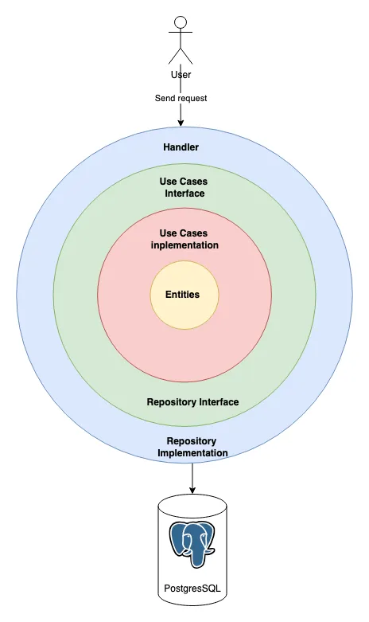

<h1 align="center">
  My Anime List
  <br>
</h1>

<p align="center">
  <a href="#built-with">Built With</a> •
  <a href="#architecture">Architecture</a> •
  <a href="#endpoints">Endpoints</a> •
  <a href="#installation">Installation</a> •
  <a href="#license">License</a>
</p>

## Built With

- [![Go][GO.dev]][GO-url]
- [![Gorm][GORM.io]][GORM-url]
- [![Gin-gonic][Gin-badge]][Gin-url]
- [![Postgresql][Postgresql-badge]][Postgresql-url]
- [![Docker][Docker-badge]][Docker-url]

## Architecture



## Endpoints

### Healthcheck

- **POST** `/` - Health check

### Auth Module

- **GET** `/auth/:provider` - Start OAuth with the specified provider (Google, Facebook)
- **GET** `/auth/:provider/callback` - Handle callback from OAuth provider
- **POST** `/auth/refresh-token` - Refresh authentication token
- **POST** `/auth/logout` - Logout

### User Module

- **GET** `/profile` - Retrieve user profile

### Comment Module

- **POST** `/comment` - Post a comment
- **GET** `/comment` - Get anime comments

### AnimeList Module

- **POST** `/animeList` - Add anime to user's list
- **GET** `/animeList` - Retrieve user's anime list
- **GET** `/animeList/:malID` - Get a specific anime from user's list
- **PATCH** `/animeList/:malID` - Update a specific anime in user's list
- **DELETE** `DELETE /animeList/:malID` - Remove an anime from user's list

## Installation

1. Clone the repository:

   ```bash
   git clone https://github.com/KritAsawaniramol/myAnimeList-server.git
   cd myAnimeList-server
   ```

2. Install dependencies:

   ```bash
   go mod tidy
   ```

3. Set up environment variables

   ```bash
   cp env/dev/.env.example env/dev/.env
   ```

4. Run Docker Compose for PostgreSQL, pgAdmin

    ```bash
    docker-compose up -d
    ```

    Optional:
    Accessing a Container's Shell:

    ```bash
    docker exec -it <container name> bash
    ```

    Stopping Services:

    ```bash
    docker-compose down
    ```

5. Run the project:

   ```bash
   go run main.go ./env/dev/.env
   ```

## License

Distributed under the MIT License. See LICENSE for more information.

---

> GitHub [@kritAsawaniramol](https://github.com/kritAsawaniramol) &nbsp;&middot;&nbsp;

<!-- MARKDOWN LINKS & IMAGES -->
<!-- https://www.markdownguide.org/basic-syntax/#reference-style-links -->

[Docker-url]: https://www.docker.com/
[Docker-badge]: https://img.shields.io/badge/Docker-2CA5E0?style=for-the-badge&logo=docker&logoColor=white
[GO-url]: https://go.dev/
[GO.dev]: https://img.shields.io/badge/golang-00ADD8?&style=for-the-badge&logo=go&logoColor=white
[GORM-url]: https://gorm.io/
[GORM.io]: https://img.shields.io/badge/gorm-ORM-00ADD8?style=for-the-badge&logo=go&logoColor=white
[Gin-url]: https://gin-gonic.com/
[Gin-badge]: https://img.shields.io/badge/gin-008ECF?style=for-the-badge&logo=gin&logoColor=white
[Postgresql-badge]: https://img.shields.io/badge/PostgreSQL-316192?style=for-the-badge&logo=postgresql&logoColor=white
[Postgresql-url]: https://www.postgresql.org/
